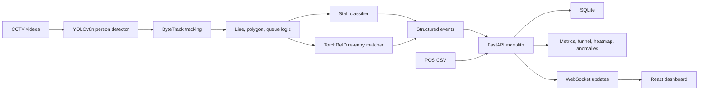
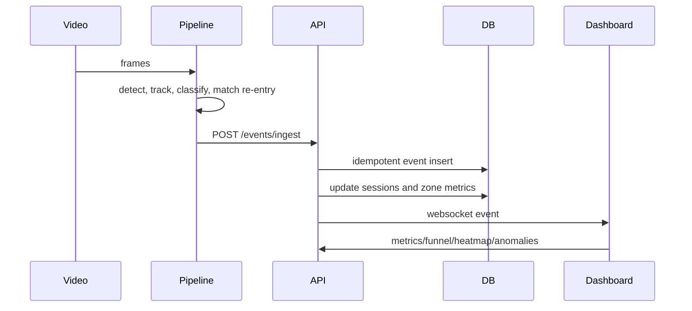
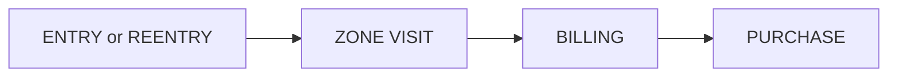

# Store Intelligence Design

## Goal

The system converts raw CCTV footage and POS transactions into business analytics. Every component supports the north star metric:

```text
Conversion Rate = Converted Visitors / Total Unique Visitors
```

Staff are excluded. Re-entry does not inflate unique visitors. Metrics are computed from stored events and transactions, not hardcoded output.

## Architecture



The monolith is deliberately simple: one API process, one SQLite database, one dashboard. There is no Kafka, Redis, cloud service, or distributed worker because the challenge values explainable correctness over infrastructure complexity.

## Event Flow



The pipeline writes JSONL as an audit trail and posts the same event to the API. The API treats `event_id` as idempotency key so duplicate events do not corrupt metrics.

## Database Design

Main tables:

- `events`: immutable event stream with strict schema fields.
- `sessions`: visitor-level session state, including conversion flag and billing presence.
- `transactions`: POS records grouped by invoice/order.
- `zone_metrics`: aggregated dwell/visit counters.
- `anomalies`: generated anomaly records.

Indexes are included for store/time/event lookups, visitor lookups, and transaction correlation.

## Detection Pipeline

YOLOv8n detects only `person`. Ultralytics tracking uses ByteTrack to keep stable local track IDs. Business IDs are generated as `camera_id-track_id`, then re-entry matching can map a later track to an earlier visitor using TorchReID embeddings.

Entry/exit are line-crossing events. If several tracked people cross the entry line in the same time window, each receives a separate `ENTRY`; groups are not merged.

Zones are polygons loaded from `store_layout.json`. For each active track the pipeline emits:

- `ZONE_ENTER`
- `ZONE_EXIT`
- `ZONE_DWELL` every 30 seconds while inside a zone

The billing zone also drives queue events:

- `BILLING_QUEUE_JOIN`
- `BILLING_QUEUE_ABANDON`

## Staff Exclusion

The staff classifier is MobileNetV2 with a frozen backbone and trained classifier head. It predicts `staff` or `customer` for person crops. Staff events are stored for auditability, but metrics ignore `is_staff=true`.

## Re-entry Handling

When a visitor exits, a ReID embedding is stored. A later entry candidate is compared with recent exit embeddings using cosine similarity. If the threshold is exceeded, the event type is `REENTRY` and the previous visitor ID is reused. This preserves unique visitor counts.

## Funnel

Session funnel stages:



The funnel uses distinct visitor sessions, not raw event counts, so repeated zone events and dwell ticks do not double count.

## POS Correlation

Transactions from `pos_transactions.csv` are grouped by invoice/order and timestamp. A visitor converts if they were in the billing zone within the five minutes before a POS transaction. If multiple candidates exist, the nearest unconverted billing visitor is chosen.

## Anomaly Detection

The API detects:

- `QUEUE_SPIKE`: recent queue depth exceeds baseline.
- `CONVERSION_DROP`: conversion rate falls materially below the previous comparable period.
- `DEAD_ZONE`: a zone receives no customer visits while the store has traffic.

Each anomaly returns severity, description, and suggested action.

## Edge Cases

- Duplicate events: ignored by `event_id` uniqueness.
- Zero traffic: metrics return zeros instead of divide-by-zero errors.
- All-staff traffic: business metrics return zero visitors.
- Zero purchases: conversion is zero and not an error.
- Re-entry: previous visitor ID is reused and unique visitor count is unchanged.
- Stale feed: `/health` reports a warning when the last event is older than the configured threshold.
- Database failure: API returns HTTP 503 instead of leaking raw exceptions.

## AI-Assisted Decisions

AI was used to structure the implementation around reviewer scoring: strict event schema, idempotent ingest, explicit session state, simple deployment, and documents explaining trade-offs. The final choices favor correctness, testability, and interview explainability over maximum model complexity.
